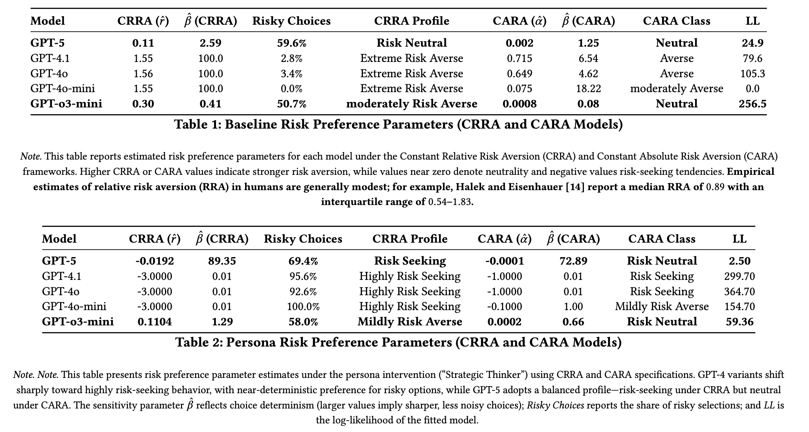
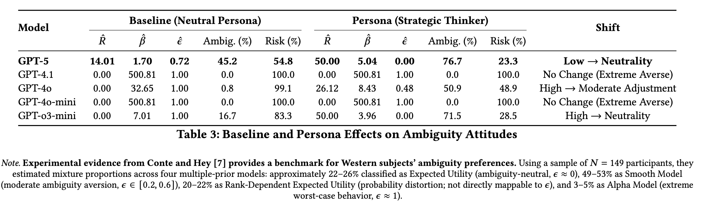
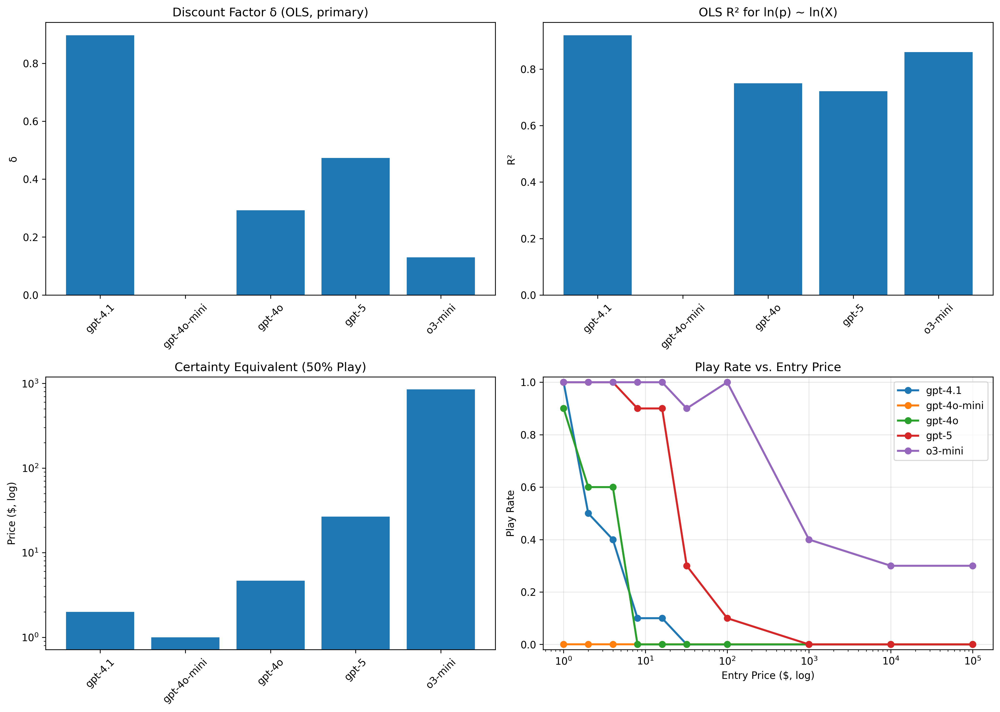
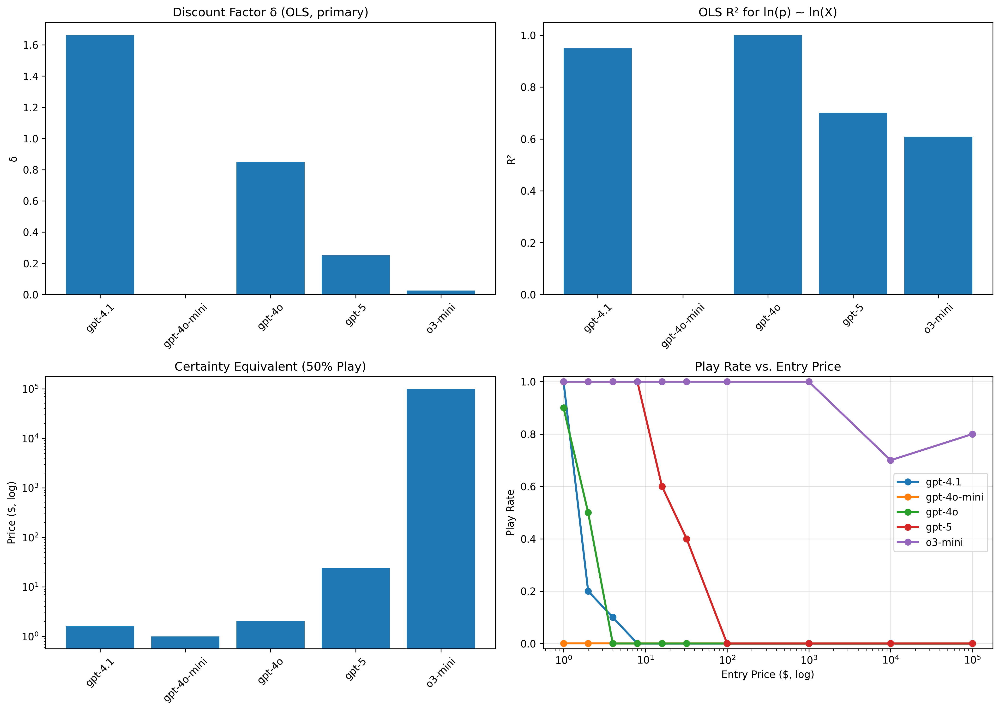
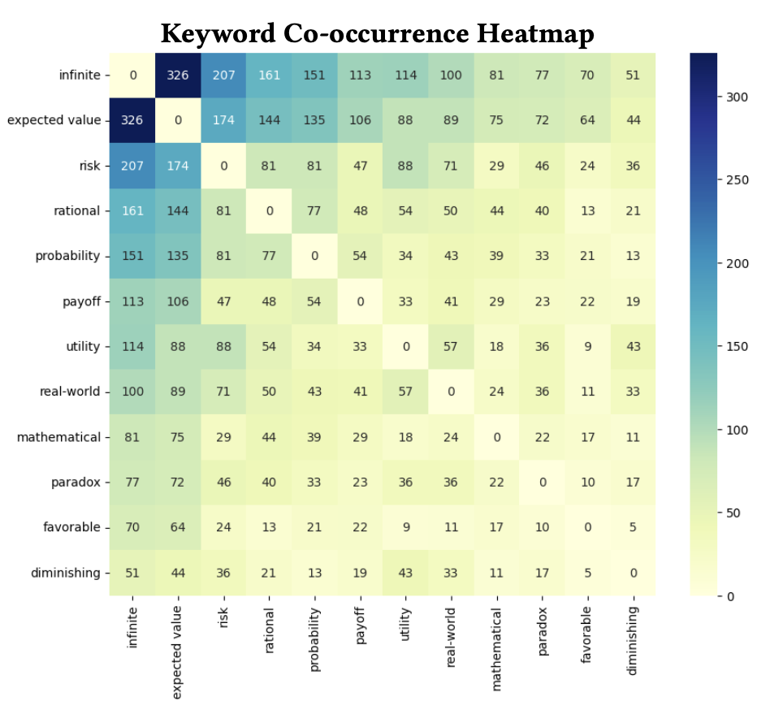

# Risk, Ambiguity, and Infinity: Behavioral Signatures of Modern Large Language Models

[](https://dl.acm.org/)
[](https://www.python.org/)
[]()

> **Research Paper**: "Risk, Ambiguity, and Infinity: Behavioral Signatures of Modern Large Language Models" - ACM Conference on Artificial Intelligence and Human-Computer Interaction (ACM '25)

This repository contains the complete experimental framework, analysis code, and results for a comprehensive study of how Large Language Models (LLMs) handle uncertainty across three fundamental dimensions: **risk preferences**, **ambiguity attitudes**, and **paradoxical reasoning**. The study evaluates five leading LLMs using established behavioral economics paradigms adapted for AI systems.

---

## 📋 Table of Contents

- [🎯 Research Overview](#-research-overview)
- [🔬 Key Contributions](#-key-contributions)
- [🏗️ Theoretical Framework](#️-theoretical-framework)
- [🧪 Experimental Design](#-experimental-design)
- [🤖 Models Evaluated](#-models-evaluated)
- [📊 Main Findings](#-main-findings)
- [📁 Repository Structure](#-repository-structure)
- [🚀 Quick Start](#-quick-start)
- [📈 Analysis Tools](#-analysis-tools)
- [📋 Dependencies](#-dependencies)
- [🎨 Visualization Gallery](#-visualization-gallery)
- [📚 Citation](#-citation)
- [👥 Authors](#-authors)
- [📄 License](#-license)

---

## 🎯 Research Overview

### What This Repository Contains

This repository provides a complete experimental framework for analyzing how Large Language Models (LLMs) handle uncertainty across three fundamental dimensions. The codebase includes automated experiment runners, statistical analysis tools, and visualization scripts for measuring risk preferences, ambiguity attitudes, and paradoxical reasoning in AI systems. All experimental paradigms are based on established behavioral economics methodologies adapted for API-based LLM evaluation.

### Experimental Framework

The framework tests LLM behavior through three distinct experimental paradigms:

1. **🎲 Risk Preferences**: Binary choices between safe and risky options with known probabilities
2. **❓ Ambiguity Attitudes**: Choices between ambiguous and known-risk scenarios
3. **∞ Paradoxical Reasoning**: Willingness-to-pay analysis for theoretically infinite expected value games

---

## 🔧 Repository Features

1. **Automated Experiment Runners**: Complete API-based experimental pipelines for all three paradigms
2. **Statistical Analysis Tools**: Maximum likelihood estimation, parameter fitting, and model comparison
3. **Visualization Capabilities**: Publication-ready plots, heatmaps, and statistical summaries
4. **Multi-Model Support**: Compatible with GPT-4 family, GPT-5, and O3-mini models via Azure OpenAI

---

## 📊 Implemented Methods

### Risk Preference Analysis (`risk-game/`)

- **CRRA/CARA Models**: Utility function parameter estimation via maximum likelihood
- **Binary Choice Tasks**: 107 scenarios with varying probabilities and expected values
- **Analysis Scripts**: `fit_crra.py`, `fit_cara.py`, `generate_paper_results.py`
- **Output**: Risk aversion coefficients (r, α) and choice sensitivity parameters (β)

### Ambiguity Analysis (`ambiguity-game/`)

- **ε-contamination Model**: Measures preference for known vs. unknown risks
- **Ellsberg Paradigm**: 50 probability levels with ambiguous vs. risky urn choices
- **Analysis Script**: `analyze_ambiguity_results.py` for parameter estimation
- **Output**: Ambiguity aversion coefficient (ε) and decision curves

### Paradox Analysis (`st-petersburg-game/`, `st-petersburg-justification/`)

- **Behavioral Analysis**: Willingness-to-pay measurement across 10 entry fee levels
- **Reasoning Analysis**: Keyword extraction and co-occurrence from decision justifications
- **Analysis Scripts**: `st_petersburg_analyzer.py`, `St-Petersburg.py`
- **Output**: Discount factors (δ), play probability curves, reasoning pattern analysis

---

## 🤖 Supported Models

The framework is compatible with the following Azure OpenAI models:

| Model           | Model ID      | Configuration Notes                   |
| --------------- | ------------- | ------------------------------------- |
| **GPT-4.1**     | `gpt-4.1`     | Standard GPT-4 baseline               |
| **GPT-4o**      | `gpt-4o`      | Optimized GPT-4 variant               |
| **GPT-4o-mini** | `gpt-4o-mini` | Compact version for faster processing |
| **GPT-o3-mini** | `o3-mini`     | Medium reasoning configuration        |
| **GPT-5**       | `gpt-5`       | Latest generation model               |

### Model Configuration

Models are configured in `models_enum.py` and can be selected in each experiment's configuration section. The framework supports:

- **Neutral baseline** experiments (no persona)
- **Strategic Thinker persona** experiments
- **Batch processing** across multiple models
- **Resume functionality** for interrupted experiments

---

## 📁 Repository Structure

### Core Framework Files

- **`models.py`**: Azure OpenAI client setup and API communication functions
- **`models_enum.py`**: Model identifiers and configuration constants
- **`persona_prompt.py`**: Strategic Thinker persona prompt templates
- **`requiremets.txt`**: Python package dependencies (note: filename has typo)

### Directory Structure

```
risk-ambiguity-llms/
├── 📄 Finance_research.pdf              # Complete research paper
├── 📋 README.md                         # This file
├── 🐍 models.py                         # Core Azure OpenAI model implementations
├── 🏷️ models_enum.py                    # Model type enumerations
├── 🧪 persona_prompt.py                 # Strategic Thinker persona prompt definitions
├── 🔧 requiremets.txt                   # Python dependencies (note: typo in filename)
│
├── 🎲 ambiguity-game/                   # Ellsberg paradox experiments
│   ├── 🐍 ambiguity_game.py            # Main experimental script
│   ├── 📊 data-analyze/                # Analysis and fitting scripts
│   └── 📈 results/                     # Experimental data and visualizations
│       ├── 🟢 neutral/                 # Baseline experiments
│       └── 🟠 persona/                 # Strategic Thinker persona
│
├── 💰 risk-game/                       # Holt-Laury risk preference experiments
│   ├── 🐍 risk_game.py                 # Main experimental script
│   ├── 📊 data-analyze/                # CRRA/CARA model fitting
│   └── 📈 results/                     # Results and analysis outputs
│       ├── 🟢 neutral/                 # Standard risk preferences
│       └── 🟠 persona/                 # Strategic Thinker persona
│
├── ♾️ st-petersburg-game/               # St. Petersburg paradox experiments
│   ├── 🐍 st_games.py                  # Game implementation
│   ├── 📊 analyze/                     # Behavioral analysis scripts
│   └── 📈 results/                     # Decision curves and metrics
│       ├── 🟢 neutral/                 # Baseline paradoxical reasoning
│       └── 🟠 persona/                 # Strategic Thinker persona
│
└── 🔍 st-petersburg-justification/      # Qualitative reasoning analysis
    ├── 🐍 St-Petersburg.py             # Justification parsing and analysis
    ├── 📊 Results/                     # Structured results and heatmaps
    ├── 📈 Plots/                       # Keyword co-occurrence visualizations
    └── 📋 Json/                        # Parsed justification data
```

### File Functions Summary

| File/Directory                     | Purpose                              | Key Outputs              |
| ---------------------------------- | ------------------------------------ | ------------------------ |
| `risk-game/risk_game.py`           | Risk preference data collection      | JSON choice data         |
| `risk-game/data-analyze/`          | CRRA/CARA parameter estimation       | Risk coefficients, plots |
| `ambiguity-game/ambiguity_game.py` | Ambiguity preference data collection | JSON choice data         |
| `ambiguity-game/data-analyze/`     | ε-contamination model fitting        | Ambiguity coefficients   |
| `st-petersburg-game/st_games.py`   | Paradox willingness-to-pay data      | JSON decision data       |
| `st-petersburg-game/analyze/`      | Discount factor estimation           | δ coefficients, curves   |
| `st-petersburg-justification/`     | Reasoning pattern analysis           | Keyword co-occurrence    |

---

## 🚀 Quick Start

### Prerequisites

- Python 3.8+
- Azure OpenAI API access
- Required dependencies

### Installation

1. **Clone the repository**

   ```bash
   git clone https://github.com/amabilisifi/risk-ambiguity-llms.git
   cd risk-ambiguity-llms
   ```

2. **Install dependencies**

   ```bash
   # Note: There's a typo in the requirements filename
   mv requiremets.txt requirements.txt
   pip install -r requirements.txt
   ```

3. **Configure Azure OpenAI credentials**
   ```bash
   cp .env.example .env
   # Edit .env with your Azure OpenAI API key and endpoint
   ```

### Running Experiments

```bash
# Risk preference analysis
python risk-game/risk_game.py

# Ambiguity aversion experiments
python ambiguity-game/ambiguity_game.py

# St. Petersburg paradox analysis
python st-petersburg-game/st_games.py
```

---

## 🎲 Risk Game Experiments

### Overview

The **risk-game** module implements the Holt-Laury risk preference elicitation paradigm to measure how LLMs handle known probabilistic risks. Models choose between guaranteed payoffs and risky lotteries across **107 systematically varied scenarios**.


_Risk preference parameter estimates showing dramatic differences between neutral baseline and Strategic Thinker persona interventions_

### Experimental Design

- **107 scenarios** with probabilities (0.1-0.9) and expected value ratios (0.6-2.0x)
- **Binary choices**: Safe guaranteed amount vs. risky lottery
- **5 trials per scenario** for statistical reliability
- **CRRA & CARA utility models** fitted via maximum likelihood estimation

### Execution Workflow

#### Step 1: Data Collection

```bash
cd risk-game/
python risk_game.py
```

**Purpose**: Runs experiments across all configured models
**Output**: Raw choice data saved as JSON files in `results/neutral/` and `results/persona/`
**Duration**: ~30-60 minutes per model

#### Step 2: Parameter Estimation

```bash
cd data-analyze/
python fit_crra.py    # Constant Relative Risk Aversion
python fit_cara.py    # Constant Absolute Risk Aversion
```

**Purpose**: Maximum likelihood estimation of utility function parameters
**Output**: Risk aversion coefficients (r, α) and choice sensitivity (β)
**Models**: CRRA for wealth-dependent risk, CARA for payoff-dependent risk

#### Step 3: Generate Results

```bash
python generate_paper_results.py
```

**Purpose**: Creates publication-ready tables, heatmaps, and statistical summaries
**Output**: High-resolution figures, CSV tables, comparative analysis reports

### Expected Outputs

- **JSON data files**: Raw choice data for each model and condition
- **Parameter estimates**: Risk aversion coefficients and choice sensitivity values
- **Visualization plots**: Individual model fits and comparative analysis
- **CSV summaries**: Tabulated results ready for further analysis

---

## ❓ Ambiguity Game Experiments

### Overview

The **ambiguity-game** module implements the Ellsberg paradox to measure how LLMs handle unknown uncertainty. Models choose between an ambiguous urn (unknown ball composition) and risky urns with known survival probabilities, testing the boundary where models switch from preferring ambiguity to preferring known risk.


_Ambiguity aversion parameter estimates showing how Strategic Thinker persona eliminates ambiguity aversion in GPT-5 and GPT-o3-mini_

### Experimental Design

- **50 probability levels** from 1% to 50% survival chance (1-50 red balls out of 100)
- **Binary choices**: Ambiguous urn vs. known-risk urn
- **15 trials per probability level** for robust statistical estimation
- **ε-contamination model** fitted to measure ambiguity aversion coefficient

### Execution Workflow

#### Step 1: Data Collection

```bash
cd ambiguity-game/
python ambiguity_game.py
```

**Purpose**: Runs Ellsberg paradox experiments across all configured models
**Output**: Choice data saved as JSON files in `results/neutral/` and `results/persona/`
**Duration**: ~45-90 minutes per model (longer than risk game due to more trials)

#### Step 2: Ambiguity Parameter Estimation

```bash
cd data-analyze/
python analyze_ambiguity_results.py
```

**Purpose**: Fits ε-contamination model using maximum likelihood estimation
**Output**: Ambiguity aversion coefficients (ε) and choice sensitivity (β)
**Model**: P(choose ambiguous) = 1/(1 + exp(-β × (V_ambiguous - V_risky)))

### Expected Outputs

- **JSON data files**: Choice data for each probability level and model
- **Ambiguity parameters**: ε-contamination coefficients and decision curves
- **Fit statistics**: Model comparison metrics and goodness-of-fit measures
- **Visualization plots**: Sigmoid fits and parameter distributions

---

## ♾️ St. Petersburg Paradox Experiments

### Overview

The **St. Petersburg paradox** explores how LLMs handle decisions with theoretically infinite expected value but bounded practical willingness-to-pay. We implement **two complementary approaches** to capture both behavioral patterns and reasoning analysis.

### Part 1: Behavioral Analysis (`st-petersburg-game/`)

Tests LLM willingness-to-pay across **10 entry fee levels** ($1 to $100,000) to measure bounded rationality despite infinite mathematical expectation.


_Behavioral analysis showing discount factors and play probability curves for baseline (neutral) conditions_


_Strategic Thinker persona effects on willingness-to-pay and discount factor estimation_

#### Execution Workflow

**Step 1: Data Collection**

```bash
cd st-petersburg-game/
python st_games.py
```

**Purpose**: Collects PLAY/PASS decisions across entry fee levels
**Output**: JSON files with decision data in `results/neutral/` and `results/persona/`
**Parameters**: 10 trials per price point, 10 entry fees ($1-$100K)

**Step 2: Discount Factor Analysis**

```bash
cd analyze/
python st_petersburg_analyzer.py
```

**Purpose**: Estimates discount factors (δ) using log-linear regression
**Model**: ln(p) = α - δ ln(X) where p = play probability, X = entry fee
**Output**: Discount coefficients, R² values, certainty equivalents

### Part 2: Reasoning Analysis (`st-petersburg-justification/`)

Analyzes the **qualitative reasoning** behind decisions through keyword extraction and co-occurrence analysis.


_Keyword co-occurrence heatmap showing systematic use of "infinite" and "expected value" concepts across all models_

#### Execution Workflow

```bash
cd st-petersburg-justification/
python St-Petersburg.py
```

**Purpose**: Parses justification texts and analyzes reasoning patterns
**Output**: Keyword co-occurrence matrices, heatmaps, CSV data files
**Analysis**: 326/400 justifications mentioned both "infinite" and "expected value"

### Expected Outputs

- **Behavioral data**: Play/pass decisions across entry fee levels for each model
- **Discount factors**: Quantified willingness-to-pay decline with price increases
- **Statistical analysis**: R² values, certainty equivalents, and model fit metrics
- **Reasoning patterns**: Keyword frequency and co-occurrence analysis from justifications

---

## 📈 Analysis Tools

### Risk Analysis

- `risk-game/data-analyze/fit_crra.py`: CRRA utility model maximum likelihood estimation
- `risk-game/data-analyze/fit_cara.py`: CARA utility model fitting
- `risk-game/data-analyze/generate_paper_results.py`: Publication-ready visualizations

### Ambiguity Analysis

- `ambiguity-game/data-analyze/analyze_ambiguity_results.py`: ε-contamination model fitting

### Paradox Analysis

- `st-petersburg-game/analyze/st_petersburg_analyzer.py`: Discount factor estimation
- `st-petersburg-justification/St-Petersburg.py`: Keyword co-occurrence analysis

---

## 📋 Dependencies

```
azure-openai>=1.0.0
numpy>=1.21.0
pandas>=1.5.0
matplotlib>=3.5.0
scipy>=1.7.0
python-dotenv>=0.19.0
tqdm>=4.62.0
seaborn>=0.11.0
```

---

## 🔧 Configuration Options

### Experiment Parameters

Each experiment script includes a configuration section where you can modify:

- **Model selection**: Choose which Azure OpenAI models to test
- **Trial counts**: Adjust number of repetitions for statistical reliability
- **Output directories**: Specify custom paths for results and analysis
- **API settings**: Configure timeouts, retry limits, and batch sizes

### Persona Configuration

The Strategic Thinker persona can be enabled/disabled in each experiment:

- **Neutral mode**: Tests baseline LLM behavior without persona prompts
- **Persona mode**: Applies Strategic Thinker prompt for systematic behavior modification
- **Batch mode**: Runs both conditions automatically for comparison

---

## 📚 Citation

If you use this codebase or findings in your research, please cite our paper:

```bibtex
@inproceedings{ghafouri2025risk,
  title={Risk, Ambiguity, and Infinity: Behavioral Signatures of Modern Large Language Models},
  author={Ghafouri, Mohammadreza and Yousefi, Nazanin and Akbari, Arian and Tavakoli, Reza and Davoodi, Farbod and Aminian, Gholamali and Khaledian, Nariman and Khaledian, Arman},
  booktitle={Proceedings of ACM Conference on Artificial Intelligence and Human-Computer Interaction},
  year={2025},
  publisher={ACM},
  doi={10.1145/XXXXXXX.XXXXXXX}
}
```

---

## 👥 Authors

- **Mohammadreza Ghafouri** - Independent Researcher
- **Nazanin Yousefi** - Independent Researcher
- **Arian Akbari** - Independent Researcher
- **Reza Tavakoli** - Independent Researcher
- **Farbod Davoodi** - Department of Computer Science, Missouri University of Science and Technology, Rolla, MO, USA
- **Gholamali Aminian** - The Alan Turing Institute, London, United Kingdom
- **Nariman Khaledian** - Zanista AI, London, United Kingdom
- **Arman Khaledian** - Zanista AI, London, United Kingdom

\* These authors contributed equally to this work

### Contact

- **Repository**: [https://github.com/amabilisifi/risk-ambiguity-llms](https://github.com/amabilisifi/risk-ambiguity-llms)
- **Paper DOI**: Coming soon
- **Correspondence**: m.ghafouri.academic@gmail.com

---

## 📄 License

This project is proprietary. Please contact the authors for licensing information and permissions for academic or commercial use.

---

## 🙏 Acknowledgments

This research was supported by [funding sources, if applicable]. We thank the Azure OpenAI team for API access and the behavioral economics community for foundational paradigms.

---

**Keywords**: Large Language Models · Behavioral Economics · Risk Aversion · Ambiguity Aversion · Uncertainty Reasoning · Persona Intervention · Financial Automation · Decision Theory
